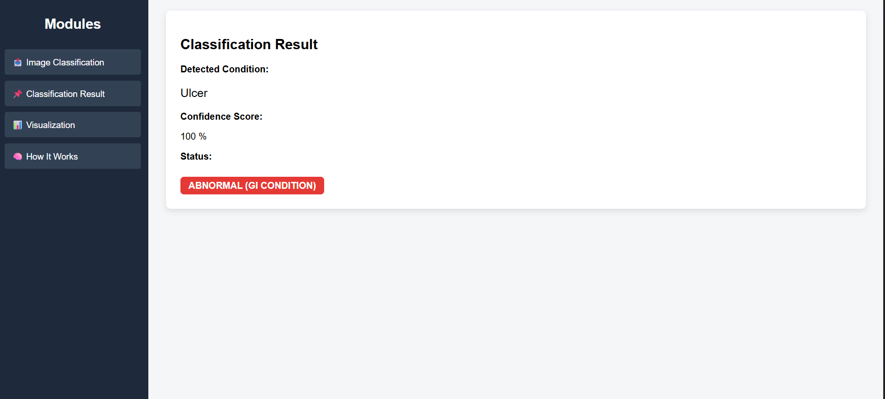

🩺 Capsule Endoscopy Classification using InceptionV3
====================================================

📌 Overview
-----------
This project is a deep learning–based medical image classification system
designed to automatically detect gastrointestinal abnormalities from
capsule endoscopy images using the InceptionV3 convolutional neural network.
It assists clinicians by providing fast and reliable diagnosis support
through an easy-to-use web interface.

The system uses transfer learning, image preprocessing, and standard
evaluation metrics to ensure accurate predictions.

---

🌐 Live Website
---------------
🚀 Experience the application live!

🔗 **Live Demo:**  
https://capsule-endoscopy-classification.onrender.com

---

✨ Features
-----------
- Automated capsule endoscopy image classification
- Transfer learning with pre-trained InceptionV3
- Image preprocessing and normalization
- Web-based image upload and prediction
- Performance evaluation using Accuracy, Precision, Recall, and F1-score
- Deployed as a live Flask web application

---

🛠️ Technologies Used
--------------------
- **Programming Language:** Python  
- **Deep Learning:** TensorFlow, Keras  
- **Web Framework:** Flask  
- **Image Processing:** OpenCV, Pillow  
- **Frontend:** HTML, CSS  
- **Deployment:** Render, Gunicorn  

---

📸 Screenshots of the Project
----------------------------

📍 Homepage  

📍 Image Upload Page  

📍 Prediction Result Page  

----------------------------
🧠 Model Details
----------------------------
Architecture: InceptionV3

Learning Method: Transfer Learning

Metrics Used:

Accuracy

Precision

Recall

F1-score

📈 Output
----------------------------

The system displays the predicted class of the uploaded capsule endoscopy
image through a user-friendly web interface.

🚀 Future Enhancements
----------------------------
Support for multi-class disease detection

Integration with larger clinical datasets

Performance optimization for faster inference

Enhanced UI and accessibility

👤 Creator
----------------------------
T Lahari
git clone https://github.com/your-username/Capsule-Endoscopy-Classification.git

